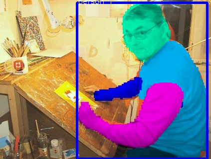
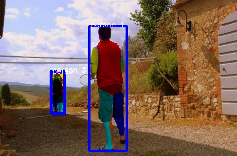
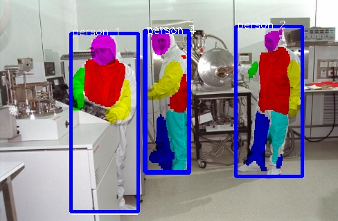
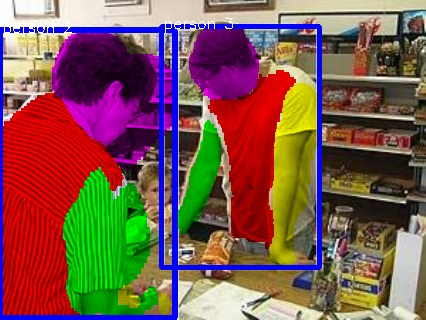
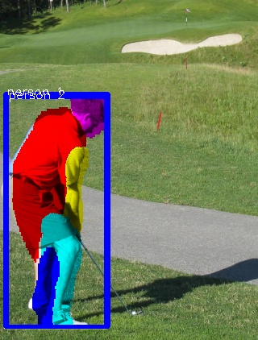
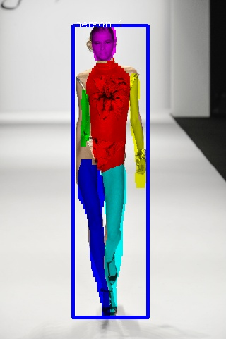

# Detecting human body parts and Building Skeleton Models using Deep Convolutional Neural Networks

This repository contains an extension to the amazing work done by [CharlesShang](https://github.com/CharlesShang/FastMaskRCNN)
This is a model of a neural network that is able to do object detection, classification and segmentation realized in collaboration with Fotonation during my 3 months internship.
The ideea is to detect all persons in an image and segment their body parts. The next step is to add keypoint regression. This is a real-time model running at 200 fps on a Titan X GPU.
A practical usage for this kind of model would be to a fashion application that looks at the information of your body and proposes the look of different clothes in order for the user to visualize their appearance.
Here are some results from the training set.









The following videos contain the model that does body segmentation (the rest of the parts are not drawn).
The model output has been modified to have 2 classes for detection (human, non-human) and 7 segmentation classes (full body, head, torso, right hand, left hand, right leg, left leg).

<a href="http://www.youtube.com/watch?feature=player_embedded&v=kcdhp1rE4Y4" target="_blank"></a>
<a href="http://www.youtube.com/watch?feature=player_embedded&v=qwtCRHeERCo" target="_blank"></a>

The following videos shows the results of the same model, but this time are drawn the body parts.

<a href="http://www.youtube.com/watch?feature=player_embedded&v=6KEgvAE0wZ0" target="_blank"></a>

# Installation
```
git clone https://github.com/Iftimie/MaskRCNN_body.git
cd MaskRCNN_body
mkdir data/coco
mkdir data/coco/records
cd data/coco/records/

wget https://www.dropbox.com/s/43ihvomchvwtpns/checkpoint
wget https://www.dropbox.com/s/v6084wee6pjlfk4/coco_resnet50_model.ckpt-248000.data-00000-of-00001
wget https://www.dropbox.com/s/0gqxnbsjzpuz0tz/coco_resnet50_model.ckpt-248000.index
wget https://www.dropbox.com/s/3uildv0wlh79oad/coco_resnet50_model.ckpt-248000.meta
#modify the checkpoint file with your path
cd ../../..
git checkout test
#modify line 180 in train/test.py with your ip address
#modify line 36 in train/client.py with the respective ip address

#in one terminal
CUDA_VISIBLE_DEVICES=0 python train/test.py

#in another terminal. Make sure to have a webcam connected
python train/client.py
```
