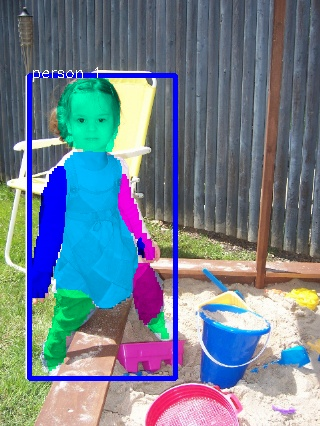

# Detecting human body parts and Building Skeleton Models using Deep Convolutional Neural Networks

This repository contains an extension to the amazing work done by [CharlesShang](https://github.com/CharlesShang/FastMaskRCNN)
This is a model of a neural network that is able to do object detection, classification and segmentation realized in collaboration with Fotonation during my 3 months internship.
The ideea is to detect all persons in an image and segment their body parts. The next step is to add keypoint regression. This is a real-time model running at 200 fps on a Titan X GPU.
A practical usage for this kind of model would be to a fashion application that looks at the information of your body and proposes the look of different clothes in order for the user to visualize their appearance.
Here are some results from the training set.

